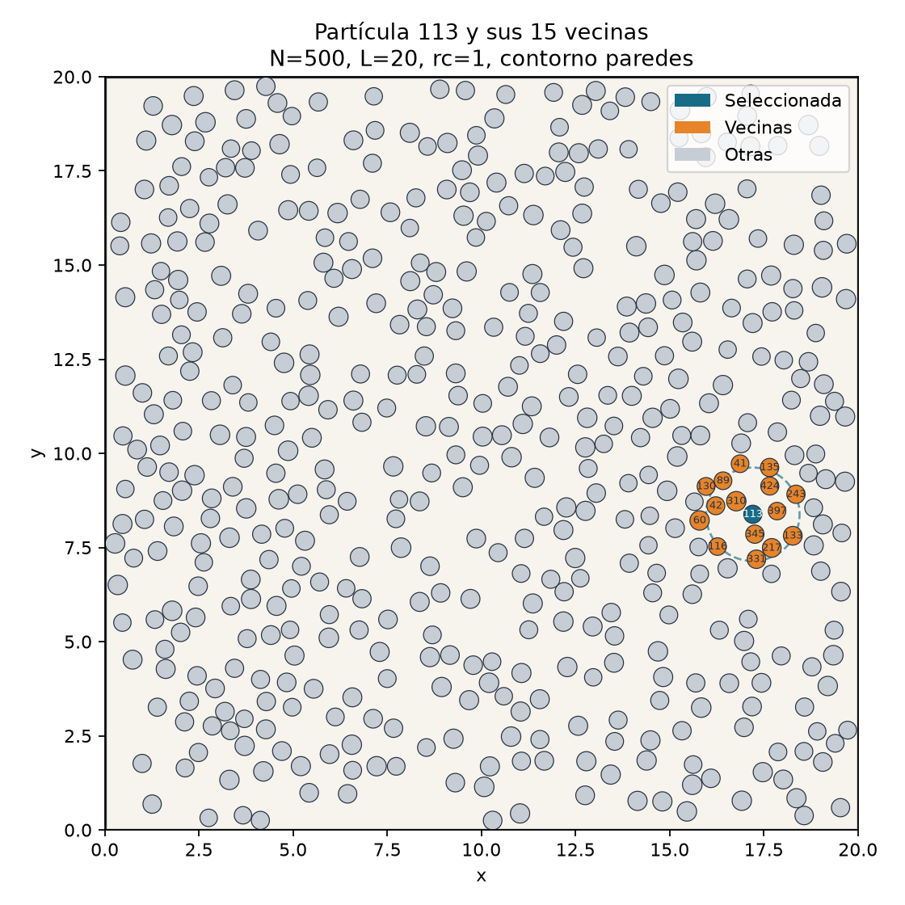
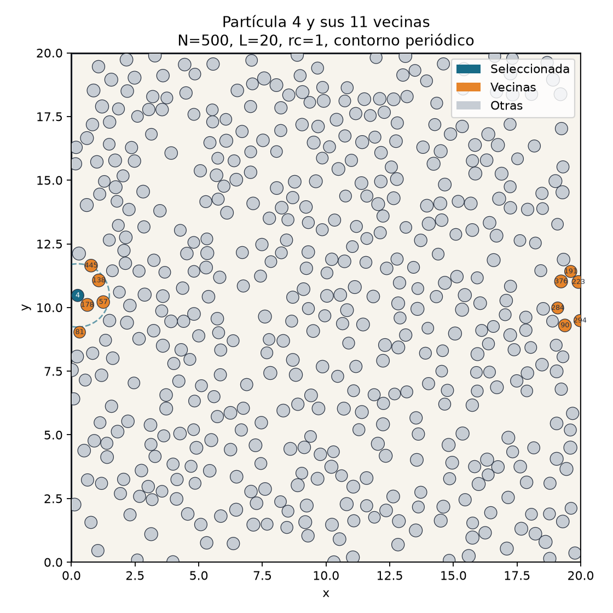
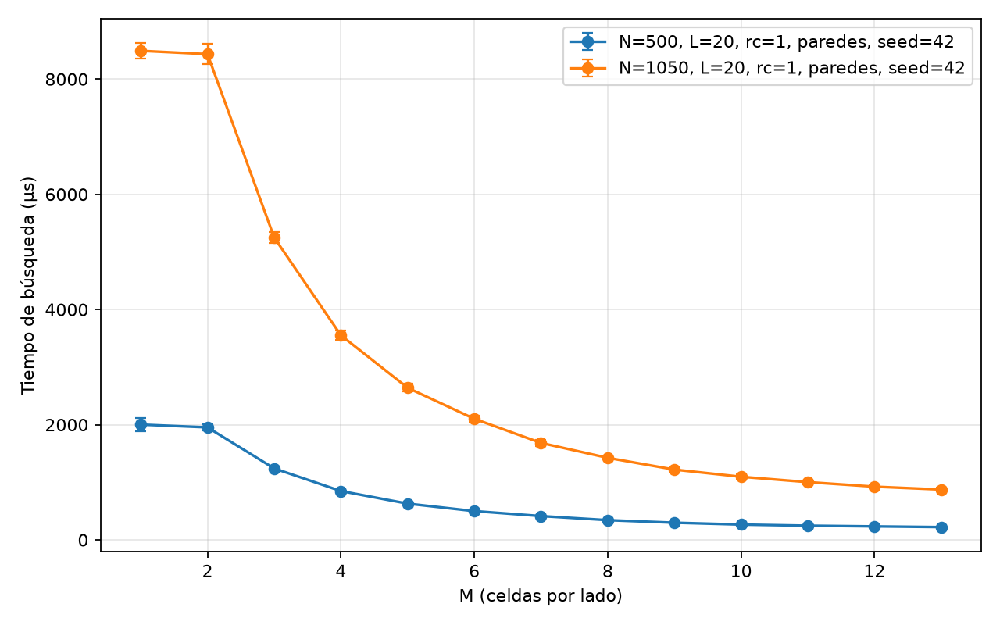
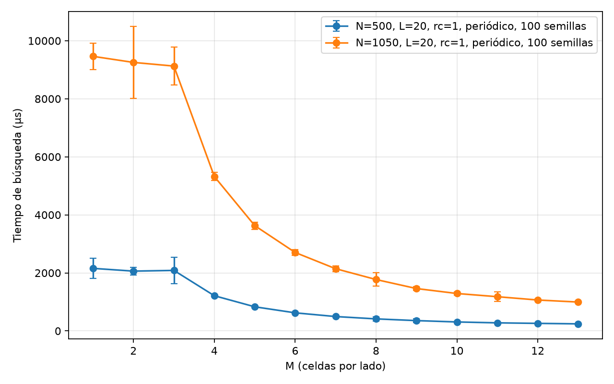
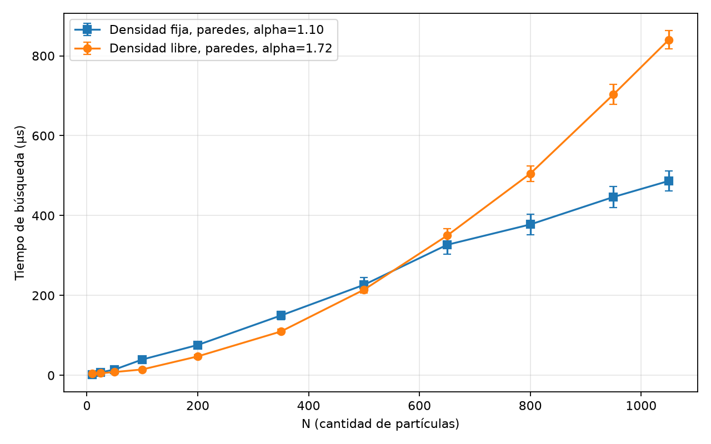
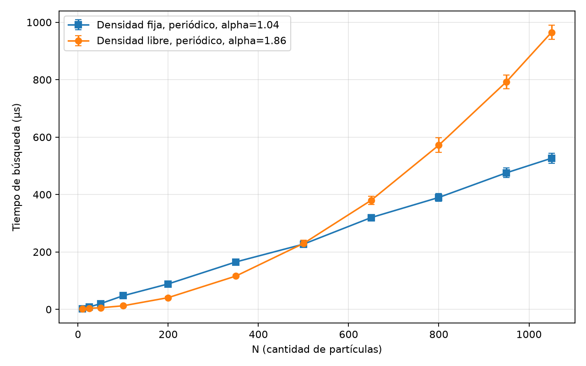
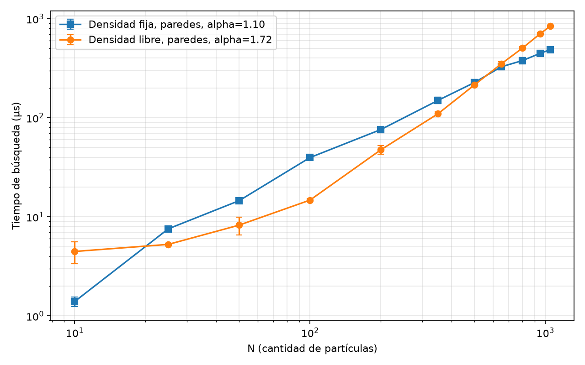
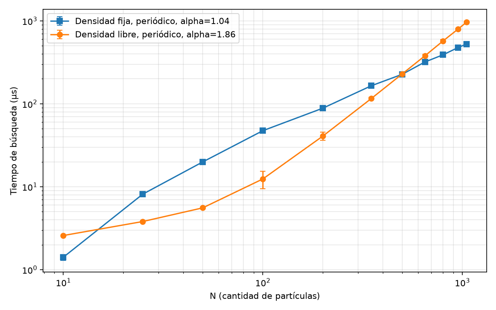

# Búsqueda eficiente de partículas vecinas mediante Cell Index Method

## Resumen

Este trabajo estudia un problema frecuente en simulaciones de partículas: dado un conjunto de discos dentro de un recinto cuadrado, encontrar para cada partícula cuáles están suficientemente cerca como para considerarlas vecinas. La solución directa compara todos los pares posibles, pero esa estrategia se vuelve costosa cuando aumenta la cantidad de partículas. Para reducir el trabajo se implementó el Cell Index Method (CIM), que divide el espacio en celdas y restringe las comparaciones a regiones cercanas.

Se implementaron y validaron dos versiones geométricas: un recinto con paredes y un dominio periódico, donde los bordes opuestos están conectados. El programa C++ genera sistemas sin superposiciones, calcula vecinos por fuerza bruta o CIM y mide únicamente el tiempo de búsqueda. El programa Python valida los resultados, calcula estadísticas y genera las figuras.

Los experimentos muestran que, para los parámetros de la consigna, `M=13` es una elección óptima común. En sistemas de 500 y 1050 partículas, el CIM fue entre 8.77 y 9.75 veces más rápido que la fuerza bruta. Al variar la cantidad de partículas con `L=20`, el exponente empírico del tiempo fue `alpha=1.72` con paredes y `alpha=1.86` con periodicidad, valores cercanos al crecimiento cuadrático esperado cuando aumenta la densidad. Al mantener constante la densidad numérica, los exponentes bajaron a `alpha=1.10` y `alpha=1.04`, respectivamente, compatibles con un crecimiento aproximadamente lineal [T01, p. 19].

## 1. Contexto del problema

Una simulación de partículas representa objetos mediante propiedades como posición, velocidad y radio. Muchos modelos físicos suponen interacciones de corto alcance: una partícula solo interactúa con objetos cercanos. Antes de calcular fuerzas, colisiones u otras interacciones, es necesario saber cuáles son esas partículas cercanas.

Este trabajo no simula una evolución física en el tiempo. Analiza un único estado `t0`, porque la detección de vecinos se aplica sobre una configuración instantánea [TP01, p. 2]. El problema computacional es:

> Para cada partícula, identificar todas las partículas cuya distancia borde a borde sea menor que un radio de interacción `rc`.

La dificultad no está solamente en calcular una distancia, sino en decidir cuántas distancias deben calcularse. Un sistema grande puede contener millones de pares posibles aunque cada partícula tenga pocas vecinas reales.

## 2. Variables y parámetros

### 2.1 Cantidad de partículas N

`N` es la cantidad total de partículas. Si `N=100`, existen 100 discos dentro del dominio. La fuerza bruta compara cada par una sola vez, por lo que realiza:

```text
pares posibles = N*(N-1)/2
```

Por ejemplo:

```text
N=500  -> 500*499/2   = 124750 pares
N=1050 -> 1050*1049/2 = 550725 pares
```

Esta expresión crece proporcionalmente a `N²`. Duplicar `N` produce aproximadamente cuatro veces más pares.

### 2.2 Longitud L

`L` es la longitud del lado del dominio cuadrado. El área disponible es:

```text
área = L²
```

Con `L=20`, el área es `400`. Si `L` permanece constante y aumenta `N`, las partículas quedan cada vez más concentradas. Si `L` aumenta junto con `N`, se puede conservar la densidad.

### 2.3 Radio de cada partícula ri

Cada partícula `i` es un disco de radio `ri`. La consigna establece radios aleatorios uniformes en el intervalo `[0.23,0.26]` cuando no se indica otra cosa [TP01, p. 1]. Uniforme significa que cualquier valor dentro del intervalo tiene la misma probabilidad de ser elegido.

Los radios no son cero. Esto es importante porque la distancia relevante no es solamente la distancia entre centros.

### 2.4 Radio de interacción rc

`rc` es la máxima separación permitida entre los bordes de dos partículas para que sean vecinas. En los experimentos se usa `rc=1`, como indica la consigna [TP01, p. 1].

Un `rc` mayor hace que cada partícula tenga más vecinas y obliga al algoritmo a considerar una región espacial más amplia.

### 2.5 Cantidad de celdas M

El CIM divide el dominio en `M` celdas por lado. La grilla completa tiene:

```text
cantidad total de celdas = M²
lado de cada celda = L/M
```

Si `L=20` y `M=10`, cada celda mide `2` unidades de lado y existen `100` celdas. Si `M=13`, existen `169` celdas y cada una mide aproximadamente `1.538`.

Un `M` pequeño produce pocas celdas con muchas partículas dentro. Un `M` grande produce muchas celdas con menos partículas, pero también aumenta el costo de construir y recorrer la grilla. Por eso existe un compromiso y se busca experimentalmente un valor óptimo.

### 2.6 Semilla aleatoria

La semilla, denominada `seed`, inicializa el generador pseudoaleatorio. Usar la misma semilla y los mismos parámetros produce exactamente los mismos radios y posiciones. Esto permite repetir un experimento sin cambiar silenciosamente el sistema.

### 2.7 Condiciones de contorno

Con paredes, cada disco debe quedar completamente dentro del cuadrado. Las partículas cercanas a una pared no interactúan con objetos del otro lado.

Con condiciones periódicas, los bordes opuestos se identifican. Una partícula próxima al borde izquierdo puede ser vecina de otra próxima al borde derecho. La distancia se calcula mediante imagen mínima:

```text
delta_min = delta - L*round(delta/L)
```

Este contorno representa una porción repetida de un sistema mayor y evita que los bordes físicos dominen el comportamiento [T01, p. 26].

## 3. Definición geométrica de vecindad

Sean dos partículas `i` y `j`. Primero se calcula la distancia euclídea entre sus centros, denominada `d_centros`. Como son discos con radios no nulos, la separación entre sus bordes es:

```text
d_borde = d_centros - ri - rj
```

Las partículas se consideran vecinas cuando:

```text
d_borde < rc
```

La desigualdad es estricta porque la consigna pide una distancia menor que `rc`, no menor o igual [TP01, p. 1]. Si los discos se superponen, `d_borde` sería negativa, pero el generador impide superposiciones.

## 4. Métodos comparados

### 4.1 Fuerza bruta

La fuerza bruta recorre todos los pares `i<j`. Para cada par calcula la distancia y, si cumple la condición, agrega cada partícula a la lista de la otra.

Su ventaja es la simplicidad: no puede perder una vecina porque inspecciona todos los pares. Por eso se utiliza como referencia de corrección u oráculo. Su desventaja es el costo `O(N²)` [T01, p. 19].

### 4.2 Cell Index Method

El CIM divide el dominio en celdas, ubica cada partícula según su centro y compara solamente:

- pares dentro de una misma celda;
- pares entre una celda y sus ocho celdas adyacentes.

Cada par de celdas se procesa una sola vez. La lista final es simétrica, está ordenada y no contiene duplicados.

La ventaja aparece cuando las celdas contienen pocas partículas: se descartan grandes cantidades de pares lejanos sin calcular sus distancias [T01, p. 21].

## 5. Derivación del tamaño seguro de celda

La consigna pregunta cómo modificar el criterio `L/M > rc` cuando las partículas tienen radio. La derivación es la siguiente.

La condición de vecindad es:

```text
d_centros - ri - rj < rc
```

Al despejar `d_centros`:

```text
d_centros < rc + ri + rj
```

Si `r_max` es el mayor radio del sistema, entonces:

```text
ri <= r_max
rj <= r_max
ri + rj <= 2*r_max
```

Por lo tanto, el mayor alcance conservador entre centros es:

```text
R = rc + 2*r_max
```

Para garantizar que dos partículas vecinas no tengan sus centros separados por una celda completa, el lado de celda debe cumplir:

```text
L/M > rc + 2*r_max
```

Con `L=20`, `rc=1` y `r_max=0.26`:

```text
R = 1 + 2*0.26 = 1.52
```

Para `M=13`:

```text
L/M = 20/13 = 1.538... > 1.52
```

Es válido. Para `M=14`:

```text
L/M = 20/14 = 1.428... < 1.52
```

Ya no es válido si solo se revisan las ocho celdas contiguas. El programa rechaza explícitamente ese valor. `M=1` se trata como un caso especial equivalente a fuerza bruta [T01, p. 23] [TP01, p. 1].

## 6. Implementación y validación

La solución separa responsabilidades:

- C++20 genera partículas, lee y escribe archivos, implementa geometría, fuerza bruta, CIM y medición de tiempos.
- Python 3 valida CSV, calcula estadísticas y produce gráficos.

La generación coloca discos aleatoriamente y rechaza candidatos superpuestos. Con paredes, el centro se limita al intervalo `[ri,L-ri]`. Con periodicidad, se representa en `[0,L)`.

Antes de aceptar cualquier medición del CIM se calcula la lista por fuerza bruta y se exige igualdad exacta. También se realiza una ejecución de calentamiento que no se registra. Esta ejecución reduce el efecto de costos iniciales como cachés frías o asignaciones que ocurren solamente la primera vez.

El temporizador incluye:

- construcción y limpieza de la grilla;
- asignación de partículas a celdas;
- recorrido de pares candidatos;
- cálculo de distancias;
- construcción de las listas de vecinos.

El temporizador excluye:

- generación de partículas;
- lectura y escritura de archivos;
- comparación contra fuerza bruta;
- análisis y visualización Python.

Esta separación evita atribuir al algoritmo costos que pertenecen a otras etapas.

## 7. Tratamiento estadístico

Una única medición puede verse afectada por otros procesos del sistema operativo, cachés y pequeñas variaciones del reloj. Por eso cada configuración se ejecuta 100 veces, una de las cantidades sugeridas por la consigna [TP01, p. 1]. Se eligieron 100 repeticiones porque ofrecen una estimación estable sin el costo innecesario de 1000 ejecuciones para cada una de las 44 configuraciones del estudio de `N`.

Si los tiempos medidos son `t1,t2,...,tR`, con `R=100`, la media es:

```text
media = (t1 + t2 + ... + tR)/R
```

La dispersión se representa mediante el desvío estándar poblacional:

```text
desvío = sqrt(sum((ti-media)²)/R)
```

Cada punto de los gráficos muestra la media. La barra de error se extiende desde `media-desvío` hasta `media+desvío`. Una barra grande indica mayor variabilidad temporal, no necesariamente un error del algoritmo.

Las mediciones finales se ejecutaron con optimización `-O3 -DNDEBUG` en un Apple M2 Pro, macOS 15.7.3 y Apple clang 17.0.0. Los tiempos absolutos cambiarán en otra computadora, pero las tendencias algorítmicas deberían conservarse.

## 8. Experimento de visualización y condiciones de contorno

### 8.1 Qué se busca evaluar

Antes de estudiar rendimiento se debe comprobar que la salida tiene sentido geométrico. Este procedimiento busca verificar visualmente que el programa identifica una partícula seleccionada, sus vecinas y el efecto de las condiciones de contorno.

### 8.2 Justificación de parámetros

Se usa `N=500` porque es el valor intermedio adoptado para el estudio de rendimiento. Es suficientemente grande para mostrar un sistema poblado, pero todavía permite distinguir los discos en una figura. Se mantienen `L=20`, `rc=1` y radios en `[0.23,0.26]` por ser los valores de referencia de la consigna.

Con paredes se seleccionó la partícula 113 porque tiene 15 vecinas y permite observar claramente el criterio local. Con periodicidad se seleccionó la partícula 4 porque está junto al borde izquierdo y tiene seis vecinas que aparecen junto al borde derecho. Esa elección permite mostrar que ambos bordes están conectados.

### 8.3 Resultados



En la Figura 1, la partícula azul es la seleccionada, las partículas naranjas son vecinas y las grises no lo son. El círculo punteado tiene radio `radio_seleccionada + rc`. Un disco vecino cumple la condición cuando intersecta esa región.



En la Figura 2, las vecinas naranjas situadas cerca de `x=20` están próximas a la partícula azul de `x≈0` mediante imagen mínima. No son falsos positivos: representan la continuidad entre los bordes.

## 9. Experimento 1: variación de M

### 9.1 Qué se busca evaluar

Este experimento busca determinar cuántas celdas por lado conviene utilizar. Se espera que la fuerza bruta sea lenta, que el tiempo disminuya al separar las partículas en más celdas y que eventualmente aparezca una meseta causada por el costo de mantener la grilla.

### 9.2 Justificación de parámetros

Se fijan `L=20`, `rc=1` y radios en `[0.23,0.26]` porque son los parámetros exigidos para este punto [TP01, p. 1].

La consigna solicita un `N` intermedio y el valor más alto posible, pero no define “posible”. Se adoptó una definición reproducible: el mayor múltiplo de 50 que puede generarse para las semillas `42`, `31415` y `20260807`, con 100000 intentos máximos por partícula, tanto con paredes como con periodicidad.

`N=1050` se generó correctamente en las seis combinaciones. `N=1100` falló al menos con una semilla en cada contorno. Por eso se eligió `N_alto=1050`. Como valor intermedio se tomó `N_intermedio=500`, aproximadamente la mitad y además útil como referencia de densidad para el experimento posterior.

Para las mediciones finales se usa la semilla 42. Las otras semillas se utilizaron para evitar que la definición de `N_alto` dependiera de una única configuración afortunada. Mantener una única semilla en las repeticiones garantiza que se mida varias veces el mismo problema y no se mezcle variabilidad geométrica con variabilidad temporal.

Se recorren todos los enteros desde `M=1` hasta `M=13`. `M=1` representa fuerza bruta y `M=13` es el máximo permitido por el criterio geométrico derivado anteriormente.

### 9.3 Resultados con paredes



| N | Fuerza bruta M=1 | Mejor M | Tiempo en el mejor M | Aceleración |
|---:|---:|---:|---:|---:|
| 500 | 2002.00 us | 13 | 222.35 us | 9.00 veces |
| 1050 | 8490.67 us | 13 | 874.27 us | 9.71 veces |

La Figura 3 muestra que el tiempo disminuye al aumentar `M`. Para `N=500`, las evaluaciones de distancia bajan de 124750 a 6168. Para `N=1050`, bajan de 550725 a 26262. La reducción de evaluaciones es cercana a 20 veces, aunque la aceleración temporal es cercana a 9 veces porque construir y recorrer la grilla también consume tiempo.

### 9.4 Resultados con periodicidad



| N | Fuerza bruta M=1 | Mejor M medido | Tiempo en el mejor M | Aceleración |
|---:|---:|---:|---:|---:|
| 500 | 2226.57 us | 12 | 254.01 us | 8.77 veces |
| 1050 | 9632.01 us | 13 | 988.26 us | 9.75 veces |

La Figura 4 muestra que, con periodicidad, `M=2` y `M=3` casi no filtran pares. Como la grilla es pequeña y los índices se envuelven, las ocho posiciones adyacentes alcanzan prácticamente todas las celdas. La mejora marcada comienza en `M=4`.

Para `N=500`, `M=12` tiene la menor media, pero `M=13` tarda solamente 1.48 us más y las barras de error se superponen. La diferencia no es significativa frente a la dispersión observada. Se adopta `M=13` como óptimo común porque minimiza los otros tres casos y simplifica el experimento siguiente.

## 10. Experimento 2: variación de N con L constante

### 10.1 Qué se busca evaluar

Este procedimiento estudia cómo crece el tiempo cuando se agregan partículas sin ampliar el recinto. Como `L=20` permanece fijo, la densidad aumenta con `N`. La teoría anticipa que el CIM puede aproximarse a un crecimiento cuadrático en este escenario, aunque con menor prefactor que fuerza bruta [T01, p. 19].

### 10.2 Justificación de parámetros

Se utilizan once valores:

```text
N = 10, 25, 50, 100, 200, 350, 500, 650, 800, 950, 1050
```

La consigna exige por lo menos diez valores desde `N=10` hasta el máximo generado [TP01, p. 1]. Se eligieron once para incluir ambos extremos, valores pequeños donde domina el costo fijo, el punto de referencia `N=500` y varios valores densos próximos al máximo.

Se conserva `L=20`. La densidad numérica es:

```text
rho = N/L² = N/400
```

Por eso cambia desde `0.025` para `N=10` hasta `2.625` para `N=1050`.

Se fija `M=13`, el óptimo común encontrado en el experimento anterior. Se mantienen `rc=1`, radios `[0.23,0.26]`, semilla 42 y 100 repeticiones. Se miden paredes y periodicidad para verificar que la conclusión no dependa de un único contorno.

### 10.3 Hipótesis previa

Al aumentar `N` en la misma área, cada celda contiene más partículas. Aunque el CIM evita comparar celdas lejanas, debe evaluar más pares dentro de cada vecindad de celdas. Se espera un crecimiento más rápido que lineal y cercano a cuadrático.

## 11. Experimento 3: variación de N a densidad fija

### 11.1 Qué se busca evaluar

Este procedimiento separa el efecto de aumentar el tamaño del sistema del efecto de amontonar partículas. Se aumenta `N`, pero también se amplía `L` para mantener constante la cantidad media de partículas por unidad de área. La teoría predice un costo aproximadamente lineal para el CIM [T01, p. 19].

### 11.2 Elección de densidad

Se elige la densidad del sistema intermedio `N=500`, `L=20`:

```text
rho = N/L² = 500/20² = 500/400 = 1.25 partículas por unidad²
```

Es una densidad intermedia del experimento anterior: no corresponde al sistema casi vacío ni al máximo empaquetado. Además, permite que las curvas de densidad libre y fija compartan exactamente el punto `N=500`, `L=20`.

### 11.3 Cálculo de L

Para mantener `rho=1.25`, se despeja `L`:

```text
rho = N/L²
L² = N/rho
L = sqrt(N/rho)
```

Por ejemplo, para `N=800`:

```text
L = sqrt(800/1.25) = sqrt(640) = 25.298...
```

### 11.4 Elección de M cuando cambia L

Mantener `M=13` mientras aumenta `L` haría que las celdas fueran cada vez más grandes. Cada celda acumularía más partículas y el experimento no mediría la complejidad esperada del CIM a densidad constante.

Se conserva en cambio el lado de celda óptimo encontrado para `L=20`, `M=13`:

```text
lado_celda_referencia = 20/13 = 1.538...
```

Para cada nuevo `L` se elige:

```text
M = floor(L/(20/13))
```

con un mínimo de `M=1`. Usar `floor` garantiza que el lado real de celda no sea menor que el lado de referencia y, por lo tanto, que continúe cumpliendo el límite geométrico. Esta regla mantiene aproximadamente constante la ocupación media de las celdas. Es una decisión metodológica inferida del objetivo de comparar complejidad a densidad constante; la consigna no explicita cómo adaptar `M` cuando cambia `L`.

### 11.5 Hipótesis previa

Si la densidad y el tamaño de celda permanecen aproximadamente constantes, cada partícula encuentra una cantidad promedio acotada de candidatas. Agregar partículas agrega nuevas celdas y trabajo en proporción al tamaño del sistema. Se espera entonces `tiempo proporcional a N`.

## 12. Resultados conjuntos de variación de N

La tabla muestra tiempos medios en microsegundos. `L_fija` y `M_fija` corresponden al experimento de densidad fija; en densidad libre siempre se usan `L=20` y `M=13`.

| N | L_fija | M_fija | Libre paredes | Fija paredes | Libre periódico | Fija periódico |
|---:|---:|---:|---:|---:|---:|---:|
| 10 | 2.828 | 1 | 4.47 | 1.40 | 2.58 | 1.41 |
| 25 | 4.472 | 2 | 5.27 | 7.57 | 3.81 | 8.13 |
| 50 | 6.325 | 4 | 8.25 | 14.56 | 5.57 | 19.93 |
| 100 | 8.944 | 5 | 14.75 | 39.63 | 12.41 | 47.41 |
| 200 | 12.649 | 8 | 47.44 | 76.01 | 40.84 | 88.64 |
| 350 | 16.733 | 10 | 109.75 | 149.79 | 115.93 | 165.15 |
| 500 | 20.000 | 13 | 214.48 | 226.66 | 229.56 | 227.16 |
| 650 | 22.804 | 14 | 349.95 | 326.84 | 379.85 | 319.73 |
| 800 | 25.298 | 16 | 505.09 | 377.76 | 571.91 | 389.80 |
| 950 | 27.568 | 17 | 703.19 | 446.49 | 792.91 | 475.73 |
| 1050 | 28.983 | 18 | 840.33 | 486.76 | 965.06 | 526.46 |

### 12.1 Paredes



En la Figura 5, las dos curvas se cruzan cerca de `N=500`, como se esperaba, porque allí ambas configuraciones tienen `L=20`, densidad `1.25` y `M=13`. Las medias no son idénticas porque se hicieron corridas separadas, pero sus barras de error se superponen.

Para valores pequeños, la densidad libre puede ser más rápida aunque use un dominio más grande: existen muy pocos pares candidatos y el costo está dominado por recorrer la estructura. A partir de `N≈500`, la densidad libre aumenta rápidamente porque se acumulan partículas en las mismas 169 celdas. La curva de densidad fija crece de manera mucho más uniforme.

### 12.2 Periodicidad



La Figura 6 presenta la misma tendencia. El contorno periódico suele ser algo más costoso porque debe envolver celdas y calcular imagen mínima, pero la diferencia no altera la conclusión sobre escalabilidad.

## 13. Estimación de complejidad mediante escala logarítmica

Para cuantificar las curvas se ajusta el modelo:

```text
tiempo = C*N^alpha
```

Al aplicar logaritmos:

```text
log(tiempo) = log(C) + alpha*log(N)
```

En un gráfico log-log, `alpha` es la pendiente. Se ajustan los puntos con `N>=100` para reducir la influencia de costos fijos dominantes en sistemas muy pequeños. `alpha≈1` indica crecimiento lineal y `alpha≈2` indica crecimiento cuadrático.





| Contorno | Régimen | Exponente alpha | Interpretación |
|---|---|---:|---|
| Paredes | Densidad libre | 1.72 | Superlineal, próximo al cuadrático |
| Paredes | Densidad fija | 1.10 | Aproximadamente lineal |
| Periódico | Densidad libre | 1.86 | Muy próximo al cuadrático |
| Periódico | Densidad fija | 1.04 | Prácticamente lineal |

Las Figuras 7 y 8 y los exponentes ajustados respaldan la predicción teórica: el CIM escala linealmente cuando la densidad permanece constante, pero se acerca al comportamiento cuadrático cuando crece la densidad [T01, p. 19]. Los exponentes no son exactamente 1 o 2 porque se estudia un intervalo finito, existen costos de grilla, los radios son aleatorios y los tiempos contienen ruido experimental.

## 14. Demostración parametrizable

La demostración permite modificar los parámetros y producir los tres resultados del punto 1: lista de vecinos, tiempo de ejecución y figura. Desde la carpeta del TP se ejecuta:

```bash
make release
python/.venv/bin/python scripts/demo.py \
  --N 100 \
  --L 20 \
  --M 13 \
  --rc 1 \
  --r-min 0.23 \
  --r-max 0.26 \
  --seed 42 \
  --boundary walls \
  --particle auto \
  --open
```

`--particle auto` selecciona la partícula con mayor cantidad de vecinas para que la figura sea informativa. También se puede indicar un ID concreto, por ejemplo `--particle 7`. Para mostrar periodicidad se reemplaza `--boundary walls` por `--boundary periodic`.

Si se elige un `M` que no cumple el criterio geométrico, el programa produce un error en lugar de generar silenciosamente una lista incompleta. Esto permite demostrar en vivo tanto casos válidos como la validación del límite.

## 15. Conclusiones

El Cell Index Method produjo exactamente las mismas listas de vecinos que fuerza bruta en todos los sistemas medidos. La igualdad se comprobó antes de cada bloque de mediciones, por lo que la mejora de tiempo no se obtuvo sacrificando corrección.

Para `L=20`, `rc=1` y radios hasta `0.26`, el máximo valor válido es `M=13`. Ese valor también resultó óptimo o estadísticamente indistinguible del óptimo en los cuatro experimentos de variación de `M`.

El CIM redujo entre 16.30 y 20.97 veces la cantidad de evaluaciones de distancia en los sistemas intermedio y alto. La aceleración temporal fue de 8.77 a 9.75 veces, mostrando que el costo total incluye tareas adicionales además de evaluar distancias.

El estudio de variación de `N` confirmó que la densidad es decisiva. Con `L=20`, la densidad aumenta y el tiempo crece con exponentes entre 1.72 y 1.86. Cuando se conserva `N/L²=1.25` y se escala la grilla para mantener el tamaño de celda, los exponentes quedan entre 1.04 y 1.10. Por lo tanto, los resultados son compatibles con crecimiento aproximadamente cuadrático a densidad creciente y lineal a densidad constante.

Las condiciones periódicas agregan costo geométrico, especialmente en grillas pequeñas, pero no cambian la conclusión principal. El método sigue siendo correcto y conserva la ventaja de escalabilidad.

## 16. Limitaciones y alcance

Los tiempos absolutos corresponden a una computadora concreta. No deben interpretarse como valores universales. Para comparar otra implementación se debe repetir el protocolo en la misma máquina y con la misma compilación.

Las 100 repeticiones de cada punto usan la misma configuración espacial. Por lo tanto, las barras de error representan variabilidad temporal, no variabilidad entre distintos sistemas aleatorios. Un estudio adicional podría repetir cada experimento con varias semillas y separar ambas fuentes de dispersión.

El valor `N=1050` es un máximo operativo del generador por rechazo, con tres semillas, paso 50 y 100000 intentos por partícula. No es el máximo teórico de discos que podrían empaquetarse mediante un algoritmo especializado.

Los exponentes se estiman sobre un rango finito `100<=N<=1050`. Sirven para comparar tendencias, pero no constituyen una demostración matemática de complejidad asintótica.

El escalamiento de `M` en densidad fija mantiene el lado de celda óptimo. Esta decisión es necesaria para estudiar el régimen lineal esperado, pero es una inferencia metodológica porque la consigna no especifica explícitamente cómo adaptar `M` cuando cambia `L`.

## 17. Reproducción y archivos

Los parámetros de los experimentos están en:

```text
experiments/configs/phase7-calibration.json
experiments/configs/phase8-n.json
```

Los resúmenes numéricos versionados están en:

```text
experiments/results/summary-m-walls.csv
experiments/results/summary-m-periodic.csv
experiments/results/summary-n-walls.csv
experiments/results/summary-n-periodic.csv
```

Las mediciones individuales están en `experiments/raw/`. Son regenerables y se ignoran en Git. Las figuras finales están en `experiments/figures/`.

Para ejecutar las pruebas y verificaciones:

```bash
make test
make sanitize
```

## Referencias

- `[TP01]`: Trabajo Práctico Nro. 1, Búsqueda Eficiente de Partículas Vecinas, material oficial de la cátedra.
- `[T01]`: Introducción a sistemas de muchas partículas y Cell Index Method, material teórico oficial de la cátedra.
- `[EJ01]`: archivos oficiales de ejemplo para formatos estático, dinámico y lista de vecinos.
